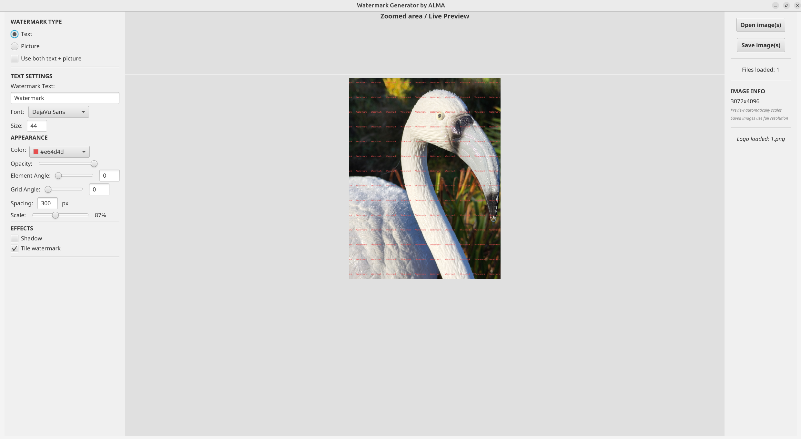
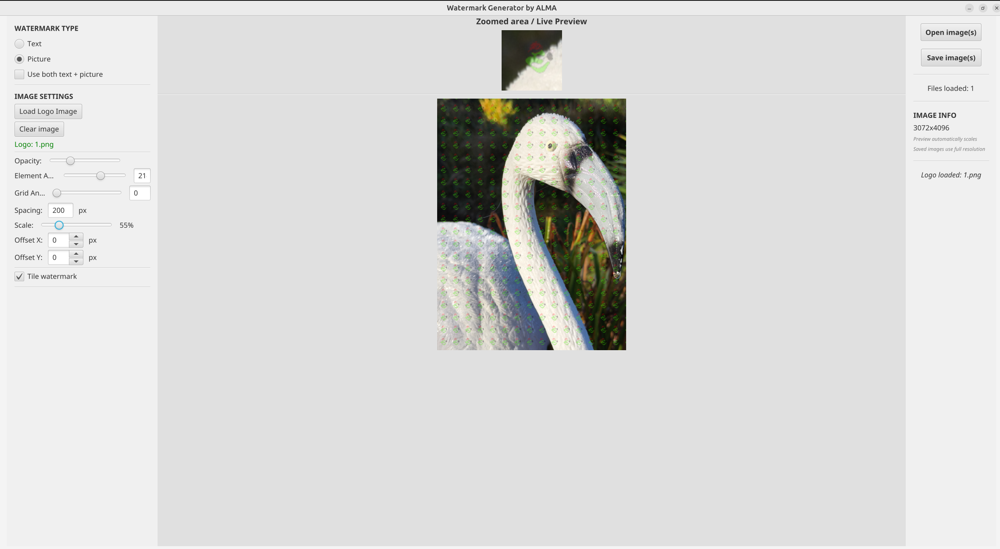

# WMG (WaterMark Generator) by ALMA

WMG is application for creating text/graphic watermarks on images (Java + JavaFX use) created fully with AI.
Now it supports only png, jpg, jpeg, gif, .bmp images formats

Not optimized yet (slow, a lot of GUI issues, enlarged preview bugs etc) but can be used for educational or personal use.

I see a lot of things to do better and gonna improve it at my free time.

Screenshots:

Text mode 
Image mode 
If you like it or hate it, let me know.!

## License

This project is licensed under the GNU GPLv3 license. This means you are free to use, modify, and distribute this code, but any derivative works must be distributed under the same open-source license.

The full license text is available in the [LICENSE](LICENSE) file.

## Support

You can support this project:
*   **ETH (ERC-20):** `0x047607977329C465344c37488D9a79a8ECC36449`
*   **USDT (TRC-20):** `TKiXgaGS57wtqQE2v8YiUZtwMjW7wtREpU'
